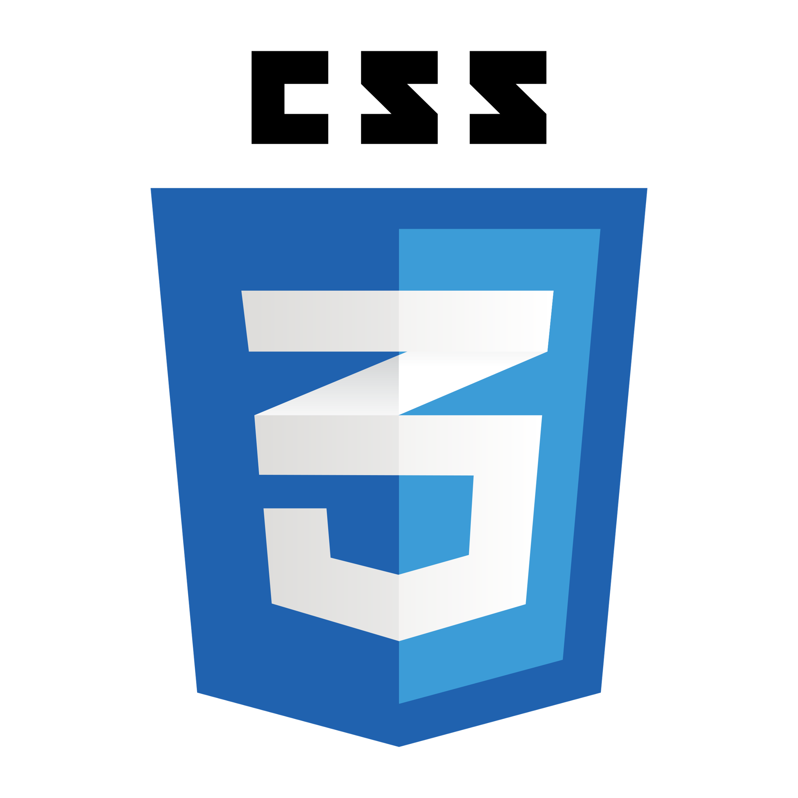
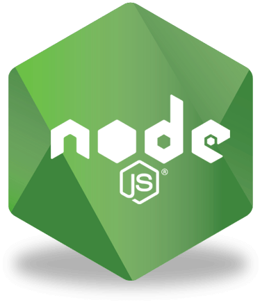
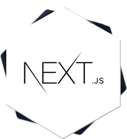
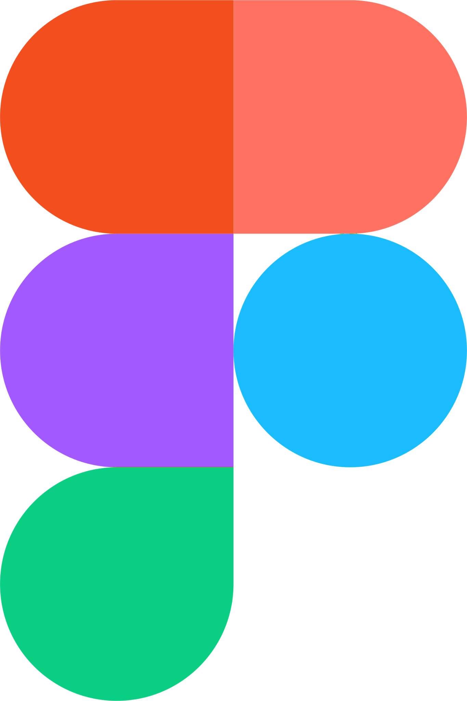
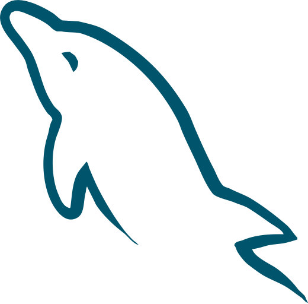
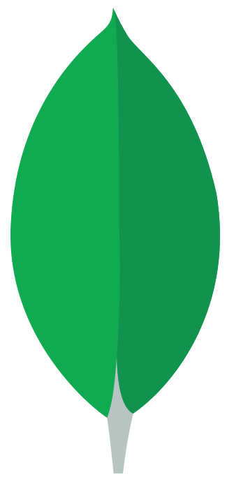

<h1 align="center">
  
</h1>

 

   
   👋 Hi, I’m <b>kibuchi Joseph</b>
    
   👀 I’m <b>interested</b> in ... <b>Cybersecurity.</b>
    
   🌱 I’m currently <b>learning</b> ... Full-stack software development at the <a href="https://www.alxafrica.com/">ALXSE</a> program.
    
   💞️ I’m <b>looking to collaborate on</b> ... Anything that helps me become better at understanding code.
    
   📫 How to reach me ... Dm me on twitter <b>@QUxPTA</b>

<h2 align="center">🔨 Languages and Tools Interacted With so Far</h2>
 

  <code></code>
  <code></code>
  <code></code>
  <code></code>
  <code></code>
  <code></code>
  <code></code>
  <code></code> 
  <code></code>
  <code></code>
  <code></code>
  <code></code> 
  <code></code> 
  <code></code>
  <code></code> 
  <code></code>
  <code></code>
  <code></code>
  <code></code>
  <code></code>
  <code></code>
  <code></code>
  <code></code>
  <code></code>
  <code></code>
  <code></code>

<h2 align="center">📊 Github Stats</h2>
 

  

    
    
  

           
  

    
  

   

